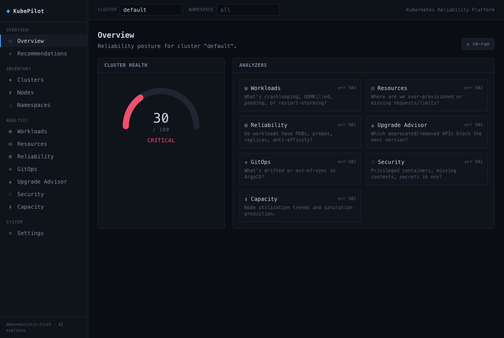
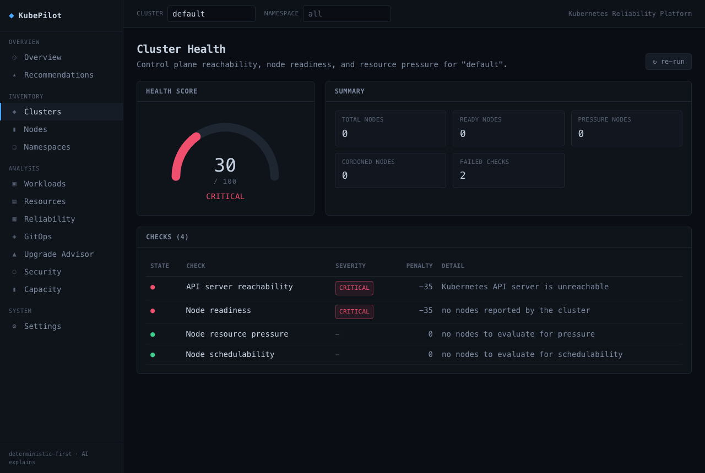

# KubePilot

[](https://github.com/kshama7/kubepilot/actions/workflows/ci.yml)
[](backend/go.mod)
[](frontend)
[](LICENSE)

A Kubernetes reliability platform that answers on-call questions with
**deterministic, rule-based analysis**. Eight Go rule engines score and triage
a live cluster; Claude only explains and prioritizes the findings those rules
already produced — it cannot invent one. No model freestyling, no vanity
metrics, no fake data.

> **Status: complete.** All 10 build milestones plus the dashboard: eight
> deterministic analyzers, the AI explanation layer, production hardening
> (Helm, Prometheus/Grafana, OpenTelemetry, CI), and a Next.js frontend. See
> [docs/roadmap.md](docs/roadmap.md) for what's next.

<p align="center">
  
  
</p>

## Architecture

```
            Go REST API (chi, OpenTelemetry-traced)
                 │
   ┌─────────────┼──────────────────────────────┐
   │             │                               │
 Zap logs   Prometheus /metrics          Analysis engine (pure rules)
                                                 │
   ┌─────────────────────────────────────────────┴───────────────┐
   │   collect (internal/k8s)            score (internal/analysis)│
   │   client-go · metrics-server ·      8 deterministic analyzers│
   │   dynamic client · Prometheus                                │
   └──────────────────────────┬───────────────────────────────────┘
                              │
                     AI explanation layer (Claude, post-analysis only)
```

Collection (I/O) and scoring (pure functions) are separate packages, so the
rule engine is fully unit-tested without a cluster — **72 tests, no kind, no
envtest, no mocked Kubernetes API.** See [docs/architecture.md](docs/architecture.md),
[docs/analysis-pipeline.md](docs/analysis-pipeline.md), and
[docs/rule-engine.md](docs/rule-engine.md).

## Supported analyses

| Module          | Question it answers                                        | Status |
|-----------------|--------------------------------------------------------------|--------|
| Cluster Health  | Is the control plane reachable and are nodes healthy?         | ✅ |
| Workload        | What's crashlooping, OOMKilled, pending, or restart-storming? | ✅ |
| Resource        | Where are we over-provisioned or missing requests/limits?     | ✅ |
| Reliability     | Do workloads have PDBs, probes, replicas, anti-affinity?      | ✅ |
| Upgrade         | Which deprecated/removed APIs block the next version?         | ✅ |
| GitOps          | What's drifted or out-of-sync in ArgoCD?                       | ✅ |
| Security        | Privileged containers, missing contexts, secrets in env?      | ✅ |
| Capacity        | Node utilization trends and saturation prediction              | ✅ |
| AI explanation  | Plain-English explanation + remediation over the above        | ✅ |

All analyzers share one finding model (`type · severity · resource · message`)
and are exposed at `GET /api/v1/clusters/{id}/<analyzer>`. The AI layer is
`?analyzer=<name>` on `/explain`. Full endpoint table in
[docs/architecture.md](docs/architecture.md).

## Real output, no cherry-picking

This is the actual response from `GET /api/v1/clusters/prod-east/health` run
against an unreachable control plane — the honest case, not a happy-path demo.
An unreachable cluster is reported as a low-scoring **finding**, not a 500:

```json
{
  "clusterId": "prod-east",
  "score": 30,
  "status": "critical",
  "summary": { "totalNodes": 0, "readyNodes": 0, "failedChecks": 2 },
  "checks": [
    {
      "id": "control-plane-reachable",
      "passed": false,
      "severity": "critical",
      "message": "Kubernetes API server is unreachable",
      "weight": 35,
      "penalty": 35,
      "details": { "error": "the server has asked for the client to provide credentials" }
    },
    {
      "id": "node-readiness",
      "passed": false,
      "severity": "critical",
      "message": "no nodes reported by the cluster",
      "weight": 35,
      "penalty": 35
    }
  ]
}
```

## Cluster Health scoring

Four weighted checks (summing to 100) over a cluster snapshot:

- **API server reachability** (35) — all-or-nothing, critical on failure
- **Node readiness** (35) — proportional to fraction NotReady
- **Resource pressure** (20) — memory / disk / PID / network conditions
- **Schedulability** (10) — cordoned nodes, capped at warning

`score = clamp(100 − Σ penalties, 0, 100)` → `healthy ≥ 90`, `degraded ≥ 70`,
else `critical`.

## Tech choices & tradeoffs

| Choice                         | Why                                                                        |
|--------------------------------|----------------------------------------------------------------------------|
| Go + `client-go`               | First-class Kubernetes API access; the language the ecosystem is written in |
| Pure scoring functions         | Rules are deterministic and testable without a live cluster                |
| Private Prometheus registry    | `/metrics` exposes exactly what we declare; no global-state collisions      |
| chi router                     | Stdlib-compatible, minimal, idiomatic `net/http` middleware                 |
| Distroless runtime image       | Small attack surface; `--healthcheck` self-probe avoids shipping curl       |
| Boot without a cluster         | API serves health/metrics and degrades analysis endpoints to 503           |
| ArgoCD via dynamic client      | Avoids vendoring the heavy argo-cd Go module for a handful of status fields |

Full reasoning, including what was deliberately *not* built and why, in
[docs/tradeoffs.md](docs/tradeoffs.md).

## Quickstart

```bash
# 1. Run the API against your current kubeconfig
cd backend && go run ./cmd/api

# 2. Check it
curl -s localhost:8080/healthz
curl -s localhost:8080/api/v1/clusters/my-cluster/health | jq
curl -s "localhost:8080/api/v1/clusters/my-cluster/workloads?namespace=default" | jq
curl -s "localhost:8080/api/v1/clusters/my-cluster/explain?analyzer=workload" | jq  # needs KUBEPILOT_ANTHROPIC_API_KEY

# 3. (optional) throwaway local cluster — requires `kind`
./scripts/kind-up.sh    # then: docker compose up --build

# 4. (optional) full observability stack — Prometheus + Grafana dashboard
docker compose --profile observability up   # Grafana → localhost:3000 (admin/admin)

# 5. (optional) the dashboard — dark terminal-style UI over the API
cd frontend && npm install && npm run dev    # → localhost:3000, proxies to the API
```

Tests: `cd backend && go test ./...` · Deploy in-cluster: `helm install kubepilot ./helm/kubepilot`

## Interview talking points

- **Why deterministic-first?** Reliability tooling must be auditable. An SRE has
  to trust the score at 3am; "the model said so" is not an answer. Rules are
  explainable and unit-tested; AI is a presentation layer, not a source of truth.
- **Collection/scoring split.** The scoring package imports no client-go, so the
  entire rule engine is covered by table tests with hand-built snapshots — no
  envtest, no kind required in CI.
- **Failures are findings.** An unreachable API server returns a `200` low-score
  report (with the error in the check details), not a `500`. That's the
  difference between a monitoring tool and a plumbing leak.
- **Weights encode on-call priority.** Cordon ≠ outage; the weighting reflects
  what actually pages someone.

More in [docs/interview-guide.md](docs/interview-guide.md) and
[docs/tradeoffs.md](docs/tradeoffs.md).

## Repo layout

```
kubepilot/
├── backend/          Go API: cmd/api, internal/{analysis,k8s,api,ai,metrics,observability,config}
├── frontend/         Next.js 14 + TS + Tailwind dashboard (dark terminal aesthetic)
├── helm/kubepilot/   Helm chart (read-only RBAC, ServiceMonitor, hardened security context)
├── observability/    Prometheus config + Grafana datasource/dashboard provisioning
├── k8s/              kind cluster config
├── docs/             architecture, analysis-pipeline, rule-engine, tradeoffs, interview-guide, roadmap
├── scripts/          kind-up.sh / kind-down.sh
├── .github/workflows ci.yml (build · vet · test -race · helm lint · docker build)
└── docker-compose.yml
```

## License

[MIT](LICENSE)
